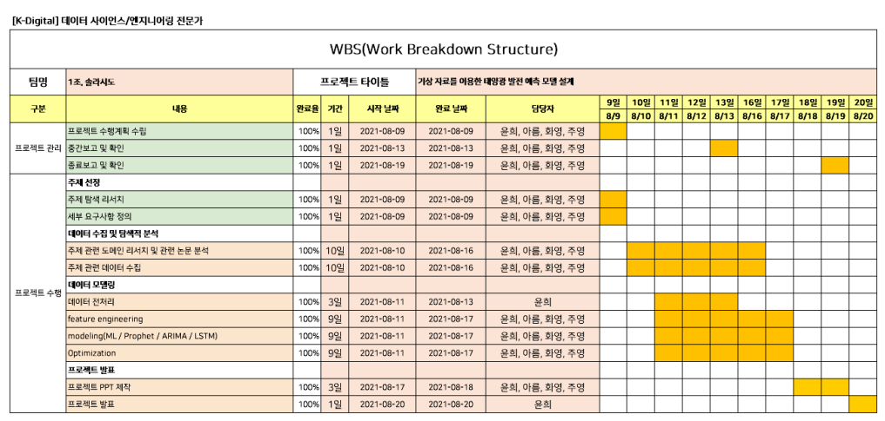
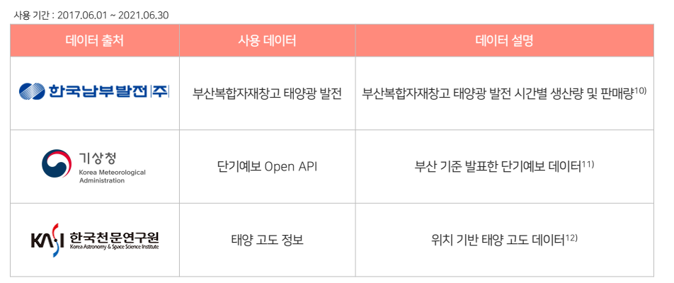
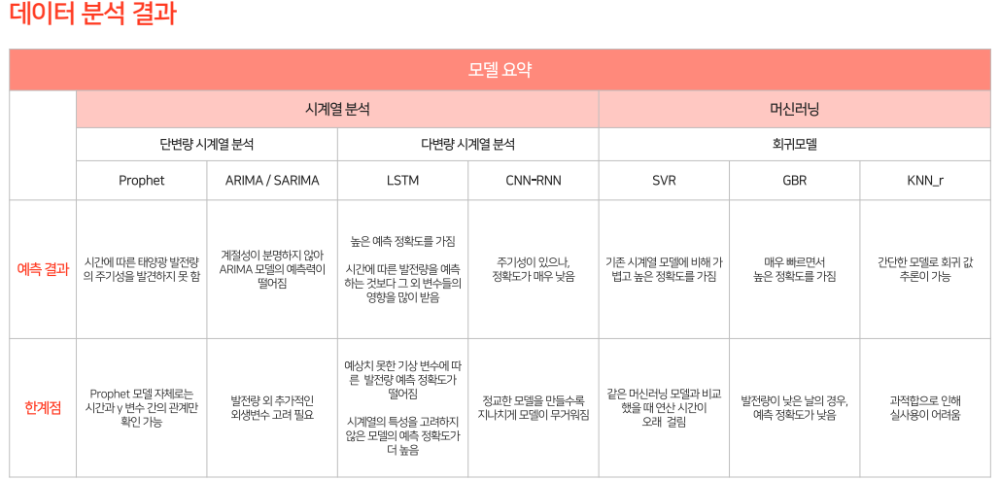
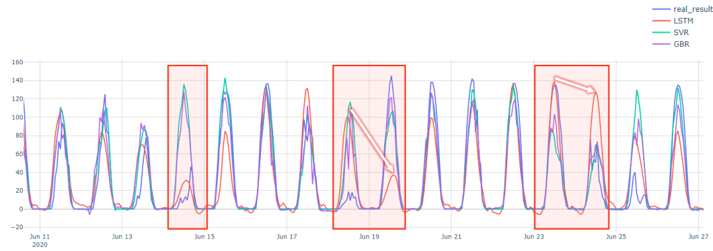
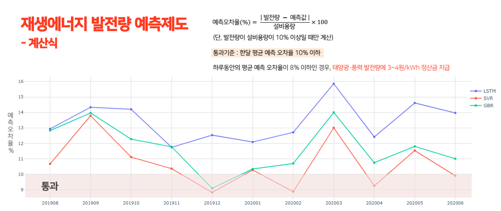
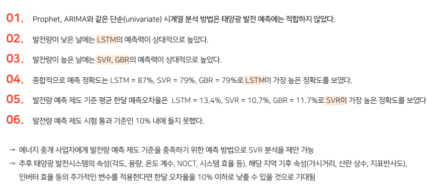

# 태양광발전 발전량 예측 기반 ESS 운영 방안 제공 서비스  
> 지역별 태양광 발전데이터와 날씨데이터 등을 수집하여 인공지능 기반으로 발전량을 예측하여 최적 ESS 운영방안 제시

## Introduction
- Final Report  [ [link](https://github.com/goareum93/Solarsido/blob/master/07%2C%20Submition/1%EC%A1%B0_%EB%B0%9C%ED%91%9CPPT_%EC%86%94%EB%9D%BC%EC%8B%9C%EB%8F%84_%EC%B5%9C%EC%A2%85.pdf) ]

## Project Process

## Dataset

## Models

## Evaluation

## Reference

[[link](https://www.notion.so/Main-b73c0f98c9d743e9ae39d6311c4003eb)]

